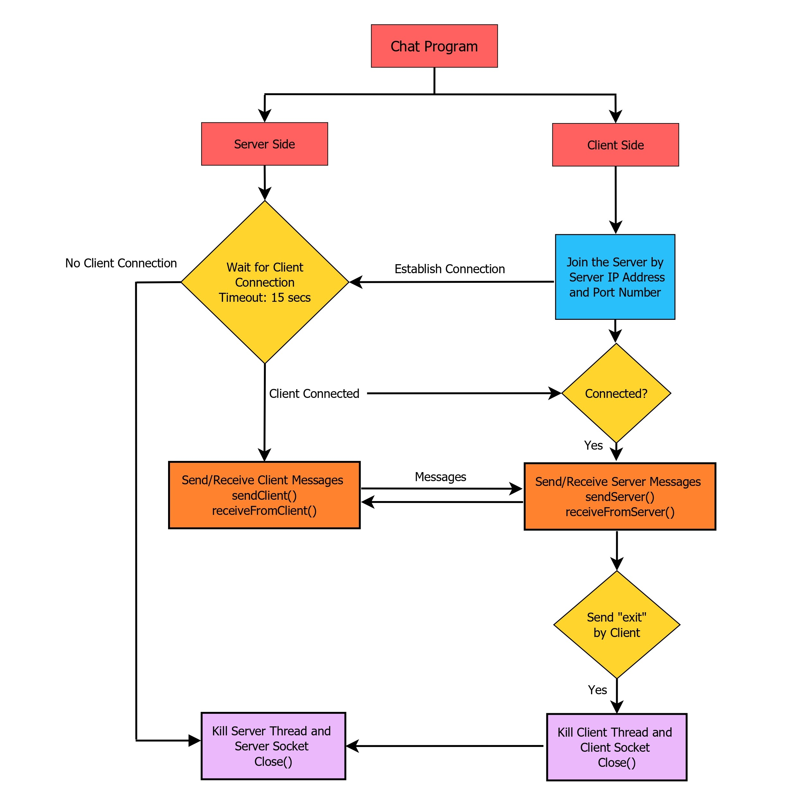
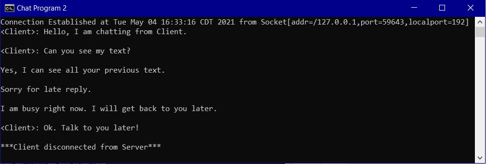
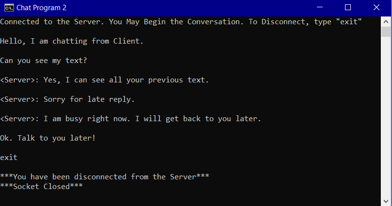

# Client_Server_Chat

A Java program using socket programming that creates a simple chat session application

## Flowchart

## Execution

Server: start a server first in the terminal

Client: now start a client in the terminal

